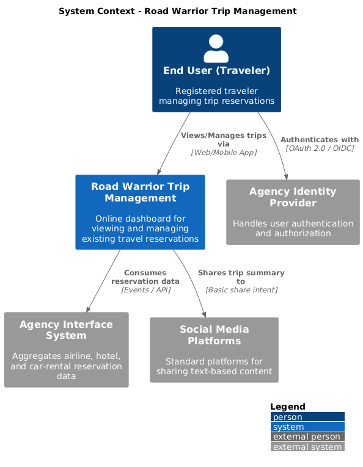
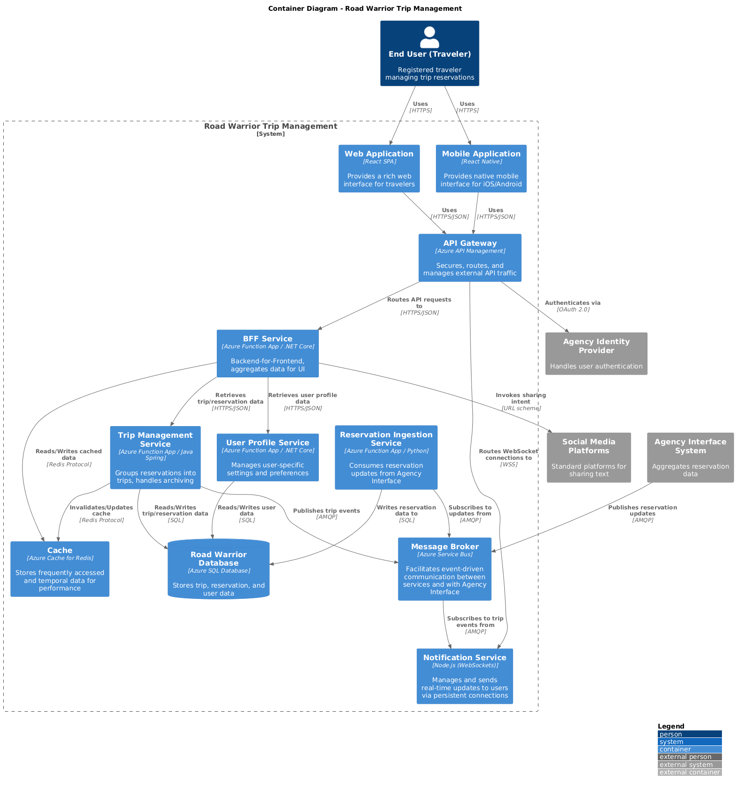
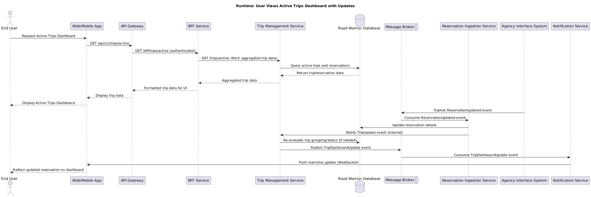
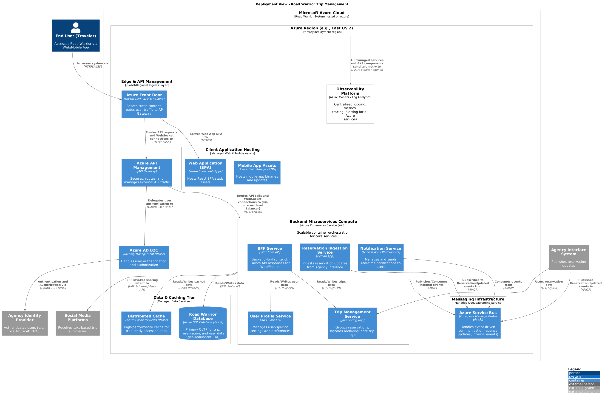

# Architecture Characterization Document (ACD)

## 1. Introduction and Goals
This document outlines the architecture for "Road Warrior," a next-generation online trip management dashboard. Its primary purpose is to provide travelers with a consolidated, real-time view of their existing travel reservations, organized by trip, across web and mobile platforms. The system focuses on displaying and managing existing trips, not on booking new travel.

### 1.1 Requirements Overview (Functional Requirements)

- **FR-1:** Automatically load existing reservations from agency's airline, hotel, and car rental interface systems using user's frequent flier/points accounts.

- **FR-2:** Allow users to manually add new or existing reservations by providing detailed reservation information.

- **FR-3:** Automatically group individual reservations into logical **"trips"** based on dates and travel patterns.

- **FR-4:** Display an active dashboard of current and upcoming trips and their associated reservations.

- **FR-5:** Automatically move completed trips and their reservations from the active dashboard to an archived **"Past Trips"** view.

- **FR-6:** Provide near real-time updates for reservation changes (e.g., delays, cancellations) reflecting in the dashboard.

- **FR-7:** Enable users to share high-level, textual trip information (e.g., *"Traveling from X to Y"*) to standard social media platforms.

- **FR-8:** Visually highlight or badge favored vendors based on data received from agency systems.

- **FR-9:** Support push notifications to users for critical trip updates (e.g., delays).

### 1.2 Quality Goals

| Priority | Quality Goal    | Scenario / Motivation                                                                                                                                                                                                                                                                                                            |
| :------- | :-------------- | :----------------------------------------------------------------------------------------------------------------------------------------------------------------------------------------------------------------------------------------------------------------------------------------------------------------------- |
| 1        | Scalability     | The system must handle an initial user base of 10,000+ growing to 50,000-100,000 active users over 2-3 years, with peak concurrent usage reaching several thousands, particularly during major travel seasons.                           |
| 2        | Responsiveness    | The "richest user interface possible" across web and mobile demands fast loading times and fluid interactions for trip data, including real-time updates for reservation changes (delays, cancellations). |
| 3        | Elasticity  | To manage fluctuating user loads efficiently (e.g., peak travel seasons vs. off-peak), the system must dynamically scale its resources up and down, optimizing cost while maintaining performance. |
| 4        | Availability    | Travelers rely on up-to-date information, especially when actively traveling. The dashboard must be highly available to ensure continuous access to critical trip details across all time zones. |
| 5       | Data Consistency | The dashboard must accurately reflect the latest reservation status (updates, cancellations, rebookings) provided by the agency system within acceptable timeframes, as travel plans are dynamic.                |
| 6        | Maintainability   | As partnership deals evolve and travel services change, the system needs to be easily adaptable for future enhancements, new data display formats, and integration improvements without major architectural overhauls.       |

---

## 2. Architecture Constraints
-   **C-1: Integration:** The system must integrate exclusively with the agency's existing airline, hotel, and car rental *interface systems* (facades), rather than directly with individual vendor APIs.

-   **C-2: Core Scope:** The system is explicitly out of scope for booking new reservations. It is solely a trip management dashboard for existing reservations.

-   **C-3: Security Context:** The system is expected to coexist within the agency's trusted infrastructure boundary, simplifying initial security and network setup, though secure communication is still paramount.

-   **C-4: Identity Management:** User authentication and initial registration are assumed to be handled by the agency's existing identity management system, with our system consuming verified user identities.

-   **C-5: Vendor Management:** The system does not support onboarding, configuring, or maintaining vendors. Favored vendors are determined and managed by the agency interface systems.

---

## 2.5 Assumptions

-   **A-1: Agency System Integration:** We assume agency interface systems can either push reservation updates via events (e.g., Kafka, Event Hubs) or provide APIs that allow efficient polling for updates (e.g., delta changes, last updated timestamps). This is critical for real-time updates.

-   **A-2: Manual Entry Data Model:** Manual reservation entry will be via a full-form input, replicating the data structure received from the agency system, ensuring data completeness and consistency for trip grouping.
-   **A-3: Trip Grouping Logic:** Automated trip grouping will primarily rely on temporal proximity (reservations within a few days of each other), geographical proximity (start/end locations), and logical sequencing (e.g., flight to hotel, then car rental). Users will have optional override capabilities to adjust groupings.

-   **A-4: Social Media Sharing:** The generated textual summary for social media sharing will be a pre-defined, generic format (e.g., "Traveling from [City A] to [City B] on [Dates]") without user customization or complex content generation.

-   **A-5: Favored Vendor Data:** The "favored vendor" status will be an attribute provided by the agency's interface systems as part of the reservation data model, allowing for simple visual representation (e.g., a badge).

-   **A-6: Internationalisation:** Initial release will focus on English language support and UTC-based time handling, with the understanding that full internationalisation (locale, currency, timezones) would be a future enhancement.

-   **A-7: Data Volume:** An average trip consists of 3-5 reservations. Historical data for "Past Trips" will be retained for 5 years.

-   **A-8: Authentication/Authorization:** End users will be authenticated via the agency identity provider (e.g.,OAuth/OIDC), leveraging existing user accounts for seamless access.

---

## 3. System Scope and Context

### 3.1 Business Context
The Road Warrior system is an online trip management dashboard designed to provide travelers with a consolidated view of their travel reservations. It consumes reservation data from the travel agency's central interface, organizes it into logical trips, and displays it via web and mobile interfaces. The system supports manual reservation entry as a fallback and allows users to share simple trip summaries. Its primary goal is to enhance the traveler's experience by offering a single, up-to-date source of truth for their travel plans.

### 3.2 Technical Context
The system integrates with the agency's backend via a predefined interface layer, which is assumed to expose reservation data through an event-driven mechanism (e.g., message queues) for updates and potentially a REST API for initial data sync or manual lookups. It interacts with standard social media platforms by making API calls to post simple text messages. The frontends (web and mobile) communicate with the backend via a secure, versioned RESTful API, supporting various client platforms.

### 3.3 Actors and Actions

| Actor | Type | Key Actions |
|------|------|-------------|
| End User (Traveler) | Human | Registers/Logs in, views active trips, views past trips, adds manual reservation, shares trip summary |
| Agency Interface System | External System | Publishes reservation updates, provides historical reservation data upon request |
| Social Media Platforms | External System | Receives text-based trip summaries for sharing |
| Notification Service (Internal) | System | Sends notifications to users (e.g., for reservation changes, as chosen design) |
| Monitoring System (Internal) | System | Collects logs, metrics, and traces for operational visibility |

---

## 4. Solution Strategy
The chosen architecture style is **Event-Driven Microservices** with a Backend-for-Frontend (BFF) pattern. This decision is primarily driven by the need for high **scalability** to support 50k-100k active users, the requirement for **data freshness** through near real-time updates from the agency system, and the "richest user interface possible" which benefits from tailored APIs. An event-driven approach enables loose coupling between services and efficient asynchronous processing of reservation updates. A modular monolith was considered but rejected due to potential bottlenecks for anticipated growth, challenges in scaling individual components independently, and increased risk for real-time responsiveness. The key trade-off accepted is the increased operational complexity inherent in managing a distributed system, requiring robust observability and deployment strategies.

## 5. Architecture Concerns & Risks

-   **Concern: Data Synchronization and Consistency**
    -   **Impact:** Users see stale or incorrect reservation information, leading to frustration and distrust in the system, especially for critical travel changes like delays or cancellations.

    -   **Mitigation:** Implement an event-driven ingestion pipeline with idempotent processing to handle updates from agency systems. Utilize a robust message broker for guaranteed delivery. Implement versioning for reservation data and use eventual consistency models where appropriate, ensuring mechanisms for reconciliation and conflict resolution. Caching strategies will balance performance with data freshness using appropriate TTLs or cache invalidation via events.

-   **Concern: Scalability for Peak Usage & High User Growth**
    -   **Impact:** The system becomes slow, unresponsive, or crashes during peak travel seasons or as user numbers increase, leading to a poor user experience and potential loss of business for the agency.

    -   **Mitigation:** Employ a microservices architecture with stateless services for horizontal scaling. Utilize a high-performance, globally distributed database for user and trip data. Implement caching at various layers (CDN, API gateway, service level). Use asynchronous processing for non-critical tasks. Deploy to a cloud-native platform with auto-scaling capabilities.

-   **Concern: Integration Reliability with Agency Systems**
    -   **Impact:** If the agency's interface layer is unreliable or changes frequently, our system could fail to receive updates, leading to data gaps, errors, or significant rework.

    -   **Mitigation:** Define clear, standardized internal data models for reservations and trips. Implement dedicated "Adapter" or "Gateway" microservices for each agency system, abstracting their specific API protocols and data formats. Use schema validation for incoming data.
-   **Concern: Delivering "Richest User Interface Possible" on Diverse Platforms**
    -   **Impact:** A poorly performing or inconsistent UI across web and mobile degrades user experience, despite a robust backend. The effort of developing for multiple platforms can be high.

    -   **Mitigation:** Implementing a Backend-for-Frontend (BFF) pattern to tailor API responses for web and mobile clients, reducing payload sizes and simplifying frontend development. Utilizing modern frontend frameworks (e.g., React/Angular for web, React Native/Flutter for mobile) that prioritize performance and cross-platform consistency. Leveraging CDN (Azure Front Door/CDN) for static assets to improve global performance.

-   **Concern: Security and Data Privacy**
    -   **Impact:** Unauthorized access to sensitive user travel information (PNR, itineraries), data breaches, non-compliance with international data protection regulations.
    
    -   **Mitigation:** Implement strong authentication (via agency IDP) and granular authorization mechanisms. Encrypt all data at rest and in transit. Conduct regular security audits, penetration testing, and adhere to "least privilege" principles for all service accounts and data access.

---

### 6. Architecture Characteristics Worksheet (ACR)

| Rank | Characteristic | Category | Justification |
|-----|---------------|----------|---------------|
| 1 | Scalability | Operational | The problem explicitly states growth from 10,000+ to 50,000–100,000 active users and "several thousand users" concurrent during peak usage, making this paramount. |
| 2 | Responsiveness | Operational | The requirement for the "richest user interface possible" across all platforms, coupled with the need to reflect real-time reservation updates, demands a highly responsive system. |
| 3 | Elasticity | Operational | The system must dynamically provision and de-provision resources (compute, database capacity) in response to fluctuating user load, ensuring cost-efficiency during off-peak times and performance during peak demand. |
| 4 | Availability | Operational | As a critical dashboard for travelers, especially during active travel, the system must be continuously accessible and operational to provide up-to-date information without interruption. |

These characteristics were chosen as the top drivers because they directly address the core challenges presented by the problem: handling significant user load, providing an excellent and timely user experience, ensuring the system is always there when travelers need it most, and efficiently managing resources for variable demand. Other important characteristics like performance and data consistency but are secondary to the operational demands for this particular problem statement.

---

## 7. Architecture Decision Records (ADRs)

[**ADR-1: Microservices Architecture with Event-Driven Design**](ADR/ADR-2.md)

[**ADR-2: Asynchronous Event-Driven Integration for Reservation Updates**](ADR/ADR-1.md)

[**ADR-3: Real-time User Interface Updates via WebSockets/SSE**](ADR/ADR-3.md)

[**ADR-4: Cloud-Native Deployment with Managed Services**](ADR/ADR-4.md)

[**ADR-5: Primary Database Choice**](ADR/ADR-5.md)

[**ADR-6: Automatic Trip Grouping Logic with User Override**](ADR/ADR-6.md)

---

## C4 — System Context Diagram

## C4 — Container Diagram

## Runtime View (Key Scenario Flow)

## Deployment View
